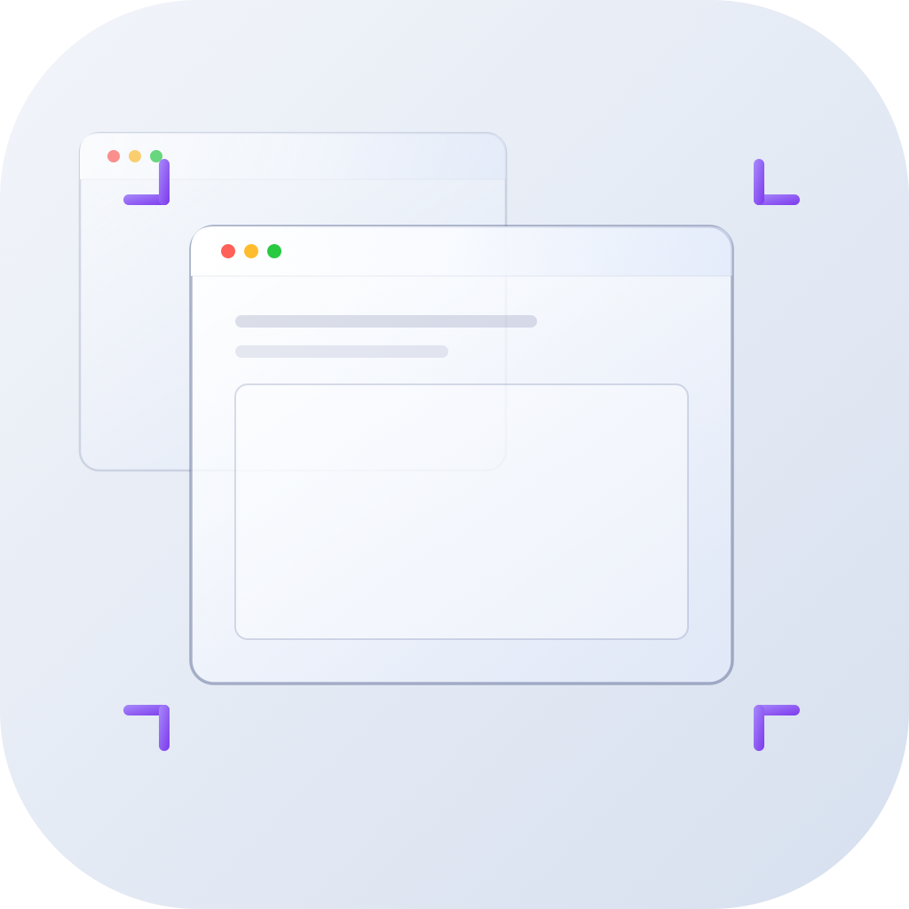
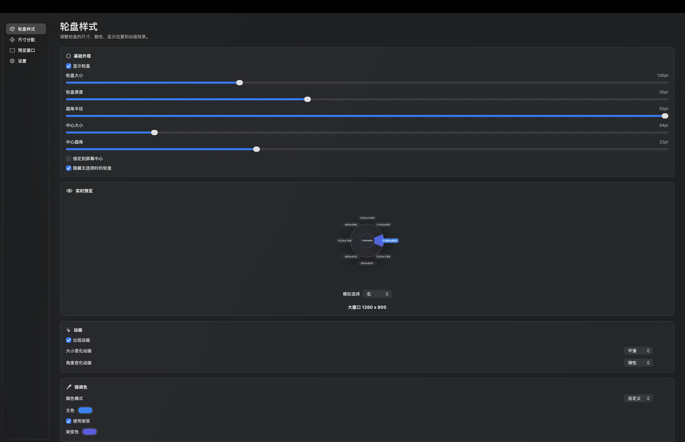
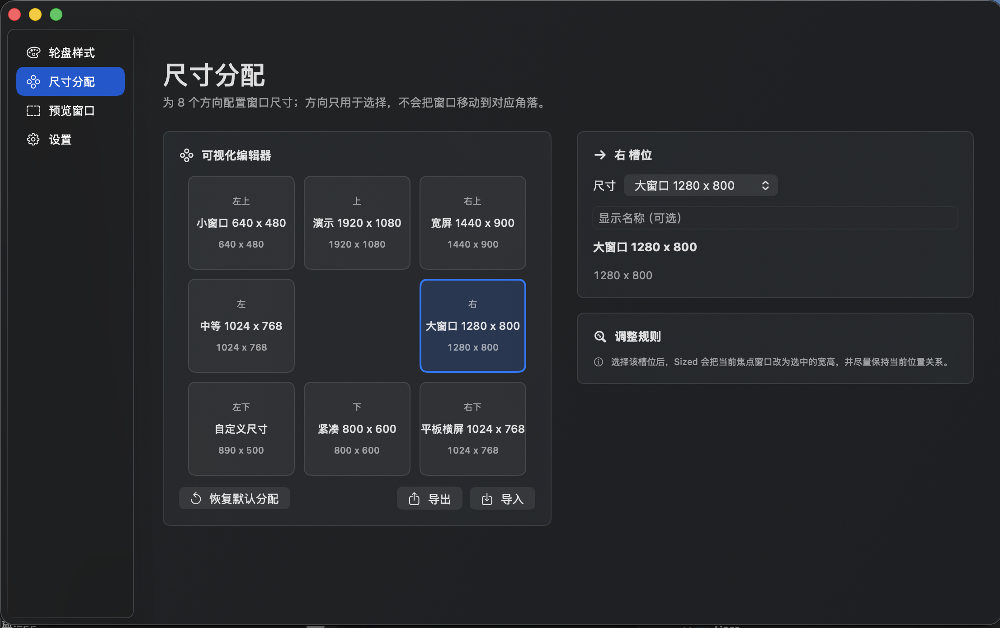

  

<h1 align="center">Sized</h1>

  <a href="#english">English</a>&nbsp;&nbsp;|&nbsp;&nbsp;<a href="#chinese">中文</a>

---

<h2 id="english">English</h2>

Sized is a native macOS window management tool that lets you instantly resize the frontmost window to preset dimensions. Trigger a beautiful radial menu with a keyboard shortcut or mouse middle-click, flick in any of 8 directions or the center slot, and release — the window snaps to the target size.

  

  

- **Native macOS app** — Built with SwiftUI + AppKit, deeply integrated with the system
- **Radial menu interaction** — 8-direction + center wheel, flick to select, release to confirm
- **50 selectable preset sizes** — Ratio-based presets across 21:9, 16:10, 16:9, 9:16, 4:3, 3:2, and 1:1, from compact sizes to ultrawide 3440×1440
- **App-specific rules** — Give Safari, Xcode, terminal apps, or any bundle ID its own wheel assignment
- **Liquid Glass ready** — Full support for macOS 26 Tahoe's Liquid Glass design language with graceful fallback on macOS 14+
- **Keyboard & mouse triggers** — Custom modifier key trigger, middle-click trigger, or both
- **Live preview window** — See the target area before confirming
- **Haptic feedback** — Native haptics on direction selection
- **Highly customizable** — Wheel size, thickness, corner radius, accent color (system / custom), animations, and full assignment mapping
- **Import, export, and utility actions** — Back up settings as JSON, undo the last resize, or restore the initial window frame
- **Launch at login** — Optional auto-start via SMAppService

### Requirements

- macOS 14.0 (Sonoma) or later
- Accessibility permission (required for window resizing)

### Default Trigger

Use **middle-click** to open the wheel, or hold the default keyboard trigger **Control-E (⌃E)**. Move your mouse toward a direction and release to resize.

### Default Radial Menu Mapping

| Direction | Action |
|-----------|--------|
| Center | Browser 1280×720 |
| ↑ Top | Presentation 1920×1080 |
| ↓ Bottom | Compact 800×600 |
| ← Left | Medium 1024×768 |
| → Right | Large 1280×800 |
| ↖ Top-Left | Small 640×480 |
| ↗ Top-Right | Wide 1440×900 |
| ↙ Bottom-Left | Portrait 405×720 |
| ↘ Bottom-Right | 3:2 1200×800 |

### App Rules

Create app-specific rules from the settings window to use different wheel assignments for different apps. Rules match by bundle identifier, and Sized falls back to the default assignment when no rule matches.

### Acknowledgments

Inspired by [Loop](https://github.com/MrKai77/Loop). 

---

<h2 id="chinese">中文</h2>

Sized 是一款 macOS 原生窗口管理工具，帮助你一键将当前窗口调整到预设尺寸。按下快捷键或鼠标中键呼出精美的径向轮盘，向 8 个方向或中心槽位滑动鼠标，松手即可完成调整。

  

  

- **macOS 原生应用** — 基于 SwiftUI + AppKit 构建，与系统深度集成
- **轮盘交互** — 8 方向 + 中心共 9 个区域，滑动选择，松手确认
- **50 种可选预设尺寸** — 覆盖 21:9、16:10、16:9、9:16、4:3、3:2、1:1 等比例，从小尺寸到 3440×1440 超宽屏
- **应用规则** — 可为 Safari、Xcode、终端类 App 或任意 Bundle ID 配置独立轮盘分配
- **Liquid Glass 适配** — 完整适配 macOS 26 Tahoe 的 Liquid Glass 设计语言，macOS 14+ 优雅降级
- **键盘与鼠标触发** — 支持自定义修饰键触发、鼠标中键触发，或同时使用
- **实时预览窗口** — 确认前预览目标区域
- **触觉反馈** — 方向选择时原生触觉反馈
- **高度可定制** — 轮盘大小、厚度、圆角、强调色（系统 / 自定义）、动画效果、完整方向分配映射
- **导入导出与辅助操作** — 支持 JSON 备份/恢复配置、撤销上一次尺寸、恢复初始窗口尺寸
- **开机自启** — 可选通过 SMAppService 登录时自动启动

### 系统要求

- macOS 14.0 (Sonoma) 或更高版本
- 辅助功能权限（窗口调整必需）

### 默认触发方式

默认可用 **鼠标中键** 呼出轮盘，也可以按住默认键盘触发键 **Control-E (⌃E)**。鼠标向对应方向滑动，松手即可调整窗口大小。

### 默认轮盘方向映射

| 方向 | 操作 |
|------|------|
| 中心 | 浏览器 1280×720 |
| ↑ 上 | 演示 1920×1080 |
| ↓ 下 | 紧凑 800×600 |
| ← 左 | 中等 1024×768 |
| → 右 | 大窗口 1280×800 |
| ↖ 左上 | 小窗口 640×480 |
| ↗ 右上 | 宽屏 1440×900 |
| ↙ 左下 | 竖屏 405×720 |
| ↘ 右下 | 3:2 1200×800 |

### 应用规则

可以在设置窗口中创建应用规则，为不同 App 使用不同的轮盘分配。规则按 Bundle Identifier 匹配；没有命中规则时，Sized 会使用默认尺寸分配。

### 致谢

灵感来源于 [Loop](https://github.com/MrKai77/Loop)。
