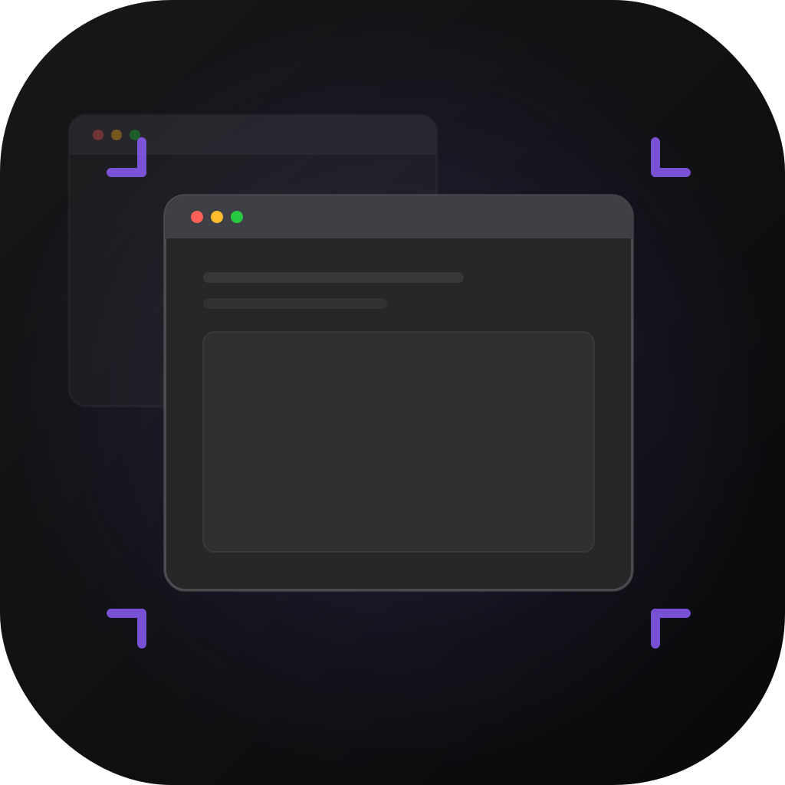

  

<h1 align="center">Sized</h1>

  <a href="#english">English</a>&nbsp;&nbsp;|&nbsp;&nbsp;<a href="#chinese">中文</a>

---

<h2 id="english">English</h2>

Sized is a native macOS window management tool that lets you instantly resize the frontmost window to preset dimensions. Trigger a beautiful radial menu with a keyboard shortcut or mouse middle-click, flick in any of 8 directions, and release — the window snaps to the target size.

  

  

- **Native macOS app** — Built with SwiftUI + AppKit, deeply integrated with the system
- **Radial menu interaction** — 8-direction + center wheel, flick to select, release to confirm
- **17 preset sizes** — Common, device reference, and custom dimensions, ranging from mobile portrait (390×844) to presentation (1920×1080)
- **Liquid Glass ready** — Full support for macOS 26 Tahoe's Liquid Glass design language with graceful fallback on macOS 14+
- **Keyboard & mouse triggers** — Custom modifier key trigger, middle-click trigger, or both
- **Live preview window** — See the target area before confirming
- **Haptic feedback** — Native haptics on direction selection
- **Highly customizable** — Wheel size, thickness, corner radius, accent color (system / wallpaper-extracted / custom), animations, and full assignment mapping
- **Cycle mode** — Assign multiple actions to one slot and cycle through them
- **Launch at login** — Optional auto-start via SMAppService

### Requirements

- macOS 14.0 (Sonoma) or later
- Accessibility permission (required for window resizing)

### Default Trigger

Press **Right Option (⌥)** and hold, then move your mouse toward a direction. Release to resize.

### Default Radial Menu Mapping

| Direction | Action |
|-----------|--------|
| ↑ Top | Presentation 1920×1080 |
| ↓ Bottom | Compact 800×600 |
| ← Left | Medium 1024×768 |
| → Right | Large 1280×800 |
| ↖ Top-Left | Small 640×480 |
| ↗ Top-Right | Wide 1440×900 |
| ↙ Bottom-Left | Mobile Portrait 390×844 |
| ↘ Bottom-Right | Tablet Landscape 1024×768 |

### Acknowledgments

Inspired by [Loop](https://github.com/MrKai77/Loop). 

---

<h2 id="chinese">中文</h2>

Sized 是一款 macOS 原生窗口管理工具，帮助你一键将当前窗口调整到预设尺寸。按下快捷键呼出精美的径向轮盘，向 8 个方向滑动鼠标，松手即可完成调整。

  

  

- **macOS 原生应用** — 基于 SwiftUI + AppKit 构建，与系统深度集成
- **轮盘交互** — 8 方向 + 中心共 9 个区域，滑动选择，松手确认
- **17 种预设尺寸** — 涵盖常用尺寸、设备参考尺寸和自定义尺寸，从手机竖屏 (390×844) 到演示屏 (1920×1080)
- **Liquid Glass 适配** — 完整适配 macOS 26 Tahoe 的 Liquid Glass 设计语言，macOS 14+ 优雅降级
- **键盘与鼠标触发** — 支持自定义修饰键触发、鼠标中键触发，或同时使用
- **实时预览窗口** — 确认前预览目标区域
- **触觉反馈** — 方向选择时原生触觉反馈
- **高度可定制** — 轮盘大小、厚度、圆角、强调色（系统 / 壁纸提取 / 自定义）、动画效果、完整方向分配映射
- **循环模式** — 同一位置可配置多个操作，轮流切换
- **开机自启** — 可选通过 SMAppService 登录时自动启动

### 系统要求

- macOS 14.0 (Sonoma) 或更高版本
- 辅助功能权限（窗口调整必需）

### 默认触发方式

按住 **右侧 Option (⌥)** 键，鼠标向对应方向滑动，松手即可调整窗口大小。

### 默认轮盘方向映射

| 方向 | 操作 |
|------|------|
| ↑ 上 | 演示 1920×1080 |
| ↓ 下 | 紧凑 800×600 |
| ← 左 | 中等 1024×768 |
| → 右 | 大窗口 1280×800 |
| ↖ 左上 | 小窗口 640×480 |
| ↗ 右上 | 宽屏 1440×900 |
| ↙ 左下 | 手机竖屏 390×844 |
| ↘ 右下 | 平板横屏 1024×768 |

### 致谢

灵感来源于 [Loop](https://github.com/MrKai77/Loop)。
